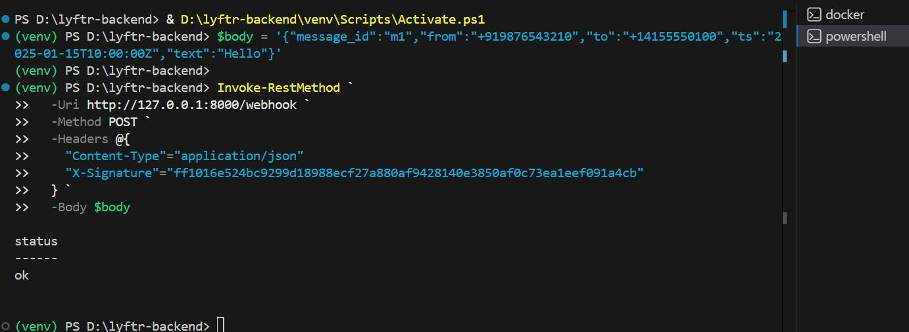
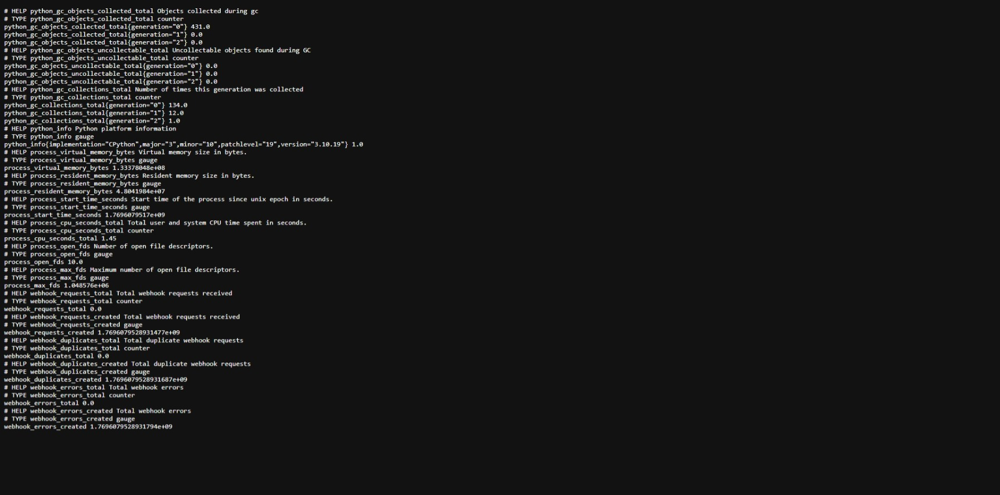
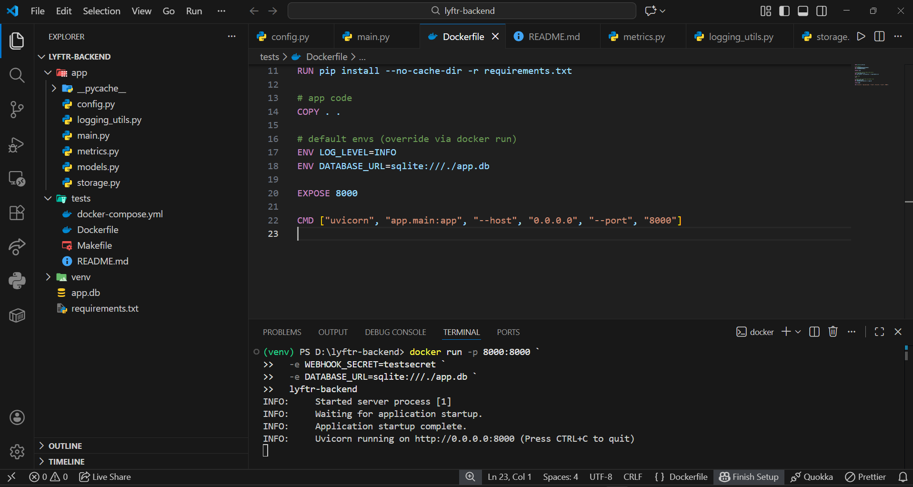

# Lyftr Backend Service 🚀

This repository contains the backend service for **Lyftr**, built as part of a backend engineering assignment.  
The service processes incoming webhooks securely, stores messages idempotently, exposes health checks, JSON logs, and Prometheus metrics, and is fully containerized using Docker.

---

## ✨ Features

- 🔐 **Secure Webhook Verification** (HMAC signature)
- 🧠 **Idempotent Message Processing**
- 🗄️ **SQLite Database** (via SQLAlchemy)
- 📊 **Prometheus Metrics** (`/metrics`)
- 🩺 **Health Checks**
  - `/health/live`
  - `/health/ready`
- 📜 **Structured JSON Logging**
- 🐳 **Dockerized Setup**

---

## 🛠️ Tech Stack

- **Python 3.10**
- **FastAPI**
- **Uvicorn**
- **SQLite**
- **Prometheus Client**
- **Docker**

---

## 📂 Project Structure

```
lyftr-backend/
│
├── app/                # Application source code
│   ├── main.py
│   ├── models.py
│   ├── database.py
│   └── metrics.py
│
├── tests/              # Infrastructure & testing
│   ├── Dockerfile
│   ├── docker-compose.yml
│   ├── Makefile
│   └── README.md
│
├── requirements.txt
├── README.md           # (this file)
└── .env.example
```

---

## ⚙️ Environment Variables

| Variable | Description |
|--------|-------------|
| `WEBHOOK_SECRET` | Secret key for webhook signature verification |
| `DATABASE_URL` | Database connection string |
| `LOG_LEVEL` | Logging level (`INFO`, `DEBUG`, etc.) |

Example:
```bash
WEBHOOK_SECRET=testsecret
DATABASE_URL=sqlite:///./app.db
LOG_LEVEL=INFO
```

---

## 🚀 Running Locally (Without Docker)

```bash
python -m venv venv
source venv/bin/activate  # Windows: venv\Scripts\activate
pip install -r requirements.txt

uvicorn app.main:app --reload
```

Server will be available at:
```
http://127.0.0.1:8000
```

---

## 🐳 Running with Docker

Refer to:
```
tests/README.md
```
for complete Docker and Docker Compose instructions.

Quick start:
```bash
docker build -t lyftr-backend -f tests/Dockerfile .
docker run -p 8000:8000 \
  -e WEBHOOK_SECRET=testsecret \
  -e DATABASE_URL=sqlite:///./app.db \
  lyftr-backend
```

---

## 📡 Webhook Endpoint

```
POST /webhook
```

Headers:
```
X-Signature: <HMAC_SHA256>
Content-Type: application/json
```

Payload example:
```json
{
  "message_id": "m1",
  "from": "+919876543210",
  "to": "+14155550100",
  "ts": "2025-01-15T10:00:00Z",
  "text": "Hello"
}
```

---

## Screenshots

### Webhook Success


### Prometheus Metrics


### Docker Container Running


### Health Check (Liveness)


## 📊 Metrics

```
GET /metrics
```

Exposes Prometheus-compatible metrics:
- `webhook_requests_total`
- `webhook_duplicates_total`
- `webhook_errors_total`

---

## 🩺 Health Checks

- `GET /health/live`
- `GET /health/ready`

---

## 🧪 Testing

Webhook can be tested via PowerShell:
```powershell
Invoke-RestMethod `
  -Uri http://127.0.0.1:8000/webhook `
  -Method POST `
  -Headers @{
    "Content-Type"="application/json"
    "X-Signature"="your_signature_here"
  } `
  -Body $body
```

---

## 📌 Notes

- Designed with **production best practices**
- Clean separation of concerns
- Ready for Kubernetes / cloud deployment

---

## 👨‍💻 Author

**Piyush Pal**  
Backend Engineer | Python | FastAPI | Docker

---

## 📄 License

This project is for evaluation and learning purposes.
